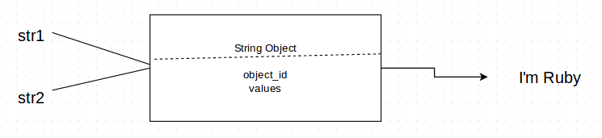
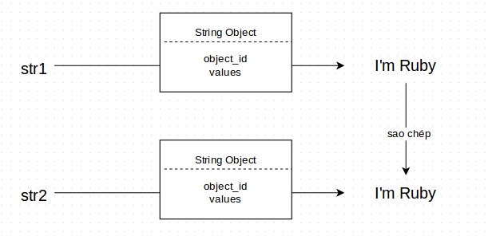

# Ruby đã nhân đôi "giá trị" (values) như thế nào?
Đã có bao giờ bạn tự hỏi rằng Ruby đã làm thế nào để sao chép giá trị của object, quá trình sao chép đó như thế nào? Và làm sao để biết được nó đang sao chép giá trị đó hay không? Hay đơn giản là sử dụng object đó dưới một cái tên biến khác? Mình có đọc được một bài viết có nói về vấn đề này, dưới đây mình xin được chia sẻ để mọi người hiểu hơn về nó. Bài viết sẽ tập trung vào một String object tuy nhiên đối với mọi object trong Ruby đều có cấu trúc tương tự như vậy.

### Hai biến dùng chung một Object
Khi khởi tạo một `String Object` mới, nó sẽ sinh ra một bộ nhớ chứa giá trị của object đó và dùng `object_id` làm con trỏ để trỏ đến vùng nhớ đó, khi ta gọi giá trị thì nó sẽ truy vấn vào vùng nhớ đó để lấy ra giá trị.

```ruby
str1 = String.new("I'm Ruby") || "I'm Ruby"
```
Khi ta gán một biến có chung giá trị với `str1` theo lệnh như sau:
```ruby
str2 = str1
```
Thực chất của lệnh trên là chúng ta đã gán biến `str2` vào object `str1` vừa mới tạo. Bạn có thể nhìn sơ đồ dưới để hiểu hơn:



Ta có thể kiểm tra `object_id` của 2 biến `str1` và `str2` như sau:
```ruby
str1.object_id
=> 172452760
str2.object_id
=> 172452760
```
2 biến trên có cùng một `object_id` vì nó cùng gán vào một `object` => Khi chúng ta thực thi bất kì hành động nào trên biến `str1` hay `str2` thì chúng ta cũng đang làm điều đó với giá trị của biến còn lại. Ví dụ như thêm từ vào `str2`, hay là `upcase!` giá trị `str2` thì `str1` cũng có giá trị như vậy vì cùng sửa chung giá trị của một Object.
```ruby
str2 << " Girl"
str2
=> "I'm Ruby Girl"
str1
=> "I'm Ruby Girl"

str2.upcase!
str2
=> "I'M RUBY GIRL"
str1
=> "I'M RUBY GIRL"
```

### Hai object có giá trị như nhau.
Với Object String `str1` như trên khi ta tạo ra `str2` với lệnh dưới thì nó mang tính chất hoàn toàn khác biệt:
```ruby
str1 = String.new("I'm Ruby") || "I'm Ruby"
str2 = str1.dup
hoặc
str2 = String.new(str1)
hoặc
str2 = str1[0..str1.length]

str2
=> "I'm Ruby"
```
3 lệnh trên đều ra kết quả giá trị của `str2` là giống `str1`. Vậy nó khác với lệnh đầu tiên kia là gì?. Khi thực thi 1 trong 3 lệnh trên bạn đã tạo ra một Object String mới bằng việc sao chép dữ liệu của `str1` có nghĩa nó sẽ có một `object_id` mới, một vùng nhớ mới và hoàn toàn riêng biệt với object `str1`.



Ta cũng có thể kiểm tra `object_id` của `str1` và `str2` như sau:
```ruby
str1.object_id
=> 172452760
str2.object_id
=> 153828400
```
=> Là 2 object riêng biệt nên ta có bất cứ hành động nào lên `str1` hay `str2` thì cũng không hề gây ảnh hưởng gì đến biến còn lại.
```ruby
str2 << " Girl"
str2
=> "I'm Ruby Girl"
str1
=> "I'm Ruby"

str1.upcase!
str2
=> "I'm Ruby Girl"
str1
=> "I'M RUBY"

```
### Kết luận
Ở trên mình đã giải nghĩa về việc nhân đôi giá trị như thế nào và bằng cách nào. Qua đó tùy vào mục đích sử dụng bạn có thể dùng nó tốt hơn, khi lập trình sẽ tránh lãng phí bộ nhớ, tránh việc gây nhầm lẫn, tạo ra những hậu quả không mong muốn.

### Tham Khảo
- http://patshaughnessy.net/2012/1/18/seeing-double-how-ruby-shares-string-values
